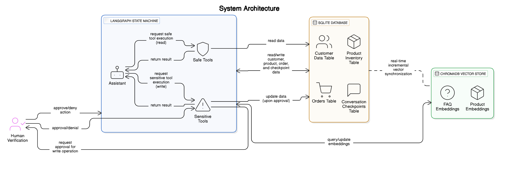
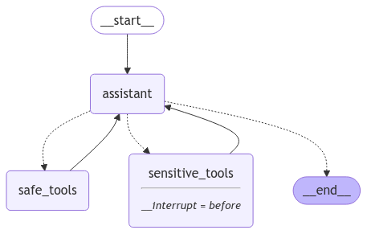
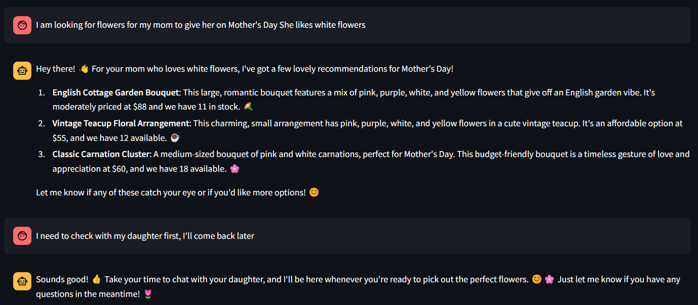
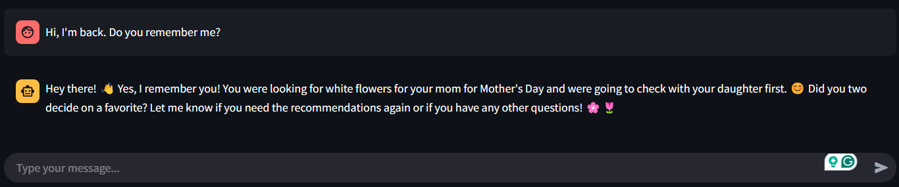
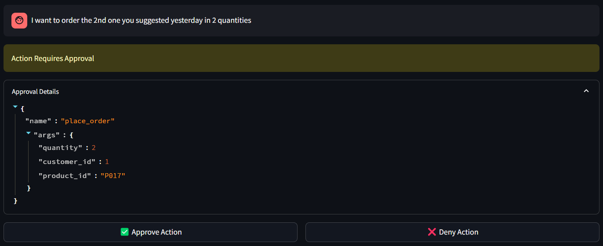
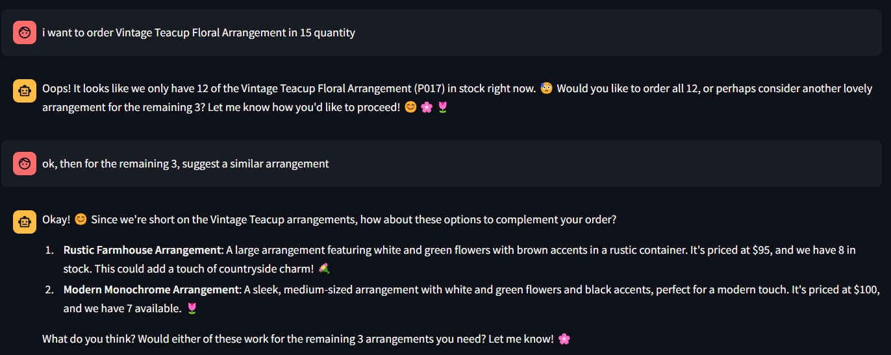

# StatefulFlora

<div align="center">
  
  
  [](https://opensource.org/licenses/Apache-2.0)
  [](https://www.python.org/downloads/)
  [](https://fastapi.tiangolo.com/)
  [](https://streamlit.io/)
  
  **A LangGraph Architecture for Secure Conversational Commerce with Persistent Context and Human-in-the-Loop Verification**
</div>

---

## 🌸 Overview

StatefulFlora is an innovative conversational AI agent for floral retail that revolutionizes e-commerce automation through a stateful architecture built on LangGraph. Our system addresses critical challenges in automated customer service by maintaining persistent context, ensuring transaction security, and providing intelligent inventory-aware recommendations.

<div align="center">
  
  <p><i>System Architecture Overview</i></p>
</div>

## ✨ Key Innovations

### 🧠 **Persistent Context Management**
Maintains dialogue and transaction state across multiple sessions using SQLite persistence, ensuring customers never lose their shopping progress.

### 🔒 **Secure Transaction Handling** 
Balances automation efficiency with security through our hybrid tool routing system that requires human verification for sensitive operations.

### 🎯 **Inventory-Aware Recommendations**
Synchronizes semantic product recommendations with real-time inventory data to prevent disappointing out-of-stock suggestions.

### 👥 **Human-in-the-Loop Security**
Implements intelligent verification workflows that maintain security without sacrificing user experience.

## 🏗️ System Architecture

StatefulFlora's robust architecture consists of three interconnected components:

<div align="center">
  
  <p><i>LangGraph State Machine Flow</i></p>
</div>

### Core Components

1. **🔄 LangGraph State Machine**: Manages conversation flow, tool routing, and history persistence through a cyclic state graph
2. **🗄️ SQLite Database**: Stores customer profiles, product inventory, order history, and conversation checkpoints
3. **🔍 ChromaDB Vector Store**: Enables semantic search for product recommendations and FAQ retrieval

## 💡 Technical Highlights

### Cyclic State Machine with SQLite Persistence
Our stateful architecture combines LangGraph's cyclic state machine with SQLite persistence, ensuring seamless conversation continuation across sessions and maintaining complete transaction history.

### Hybrid Tool Routing System
Tools are intelligently categorized for optimal security and efficiency:

| **Safe Operations** | **Sensitive Operations** |
|---------------------|--------------------------|
| ✅ Check order status | ⚠️ Place new orders |
| ✅ List order history | ⚠️ Cancel existing orders |
| ✅ Query FAQs | ⚠️ Modify customer data |
| ✅ Get recommendations | ⚠️ Process payments |

### Real-Time Vector Synchronization
ChromaDB with SentenceTransformer embeddings ensures recommendations always reflect current inventory, preventing customer disappointment from out-of-stock suggestions.

## 🚀 Quick Start

### Prerequisites
```bash
Python 3.9+
LangGraph
SQLite
ChromaDB
SentenceTransformers
Gemini 2.0 Flash API access
```

### Installation

```bash
# Clone the repository
git clone https://github.com/RamanarayanRansingh/StateFlora.git
cd StatefulFlora

# Create virtual environment
python -m venv venv
source venv/bin/activate  # Windows: venv\Scripts\activate

# Install dependencies
pip install -r requirements.txt

# Configure environment
cp .env.example .env
# Edit .env with your API keys
```

## 🎮 Running the Application

### 🔧 FastAPI Backend
```bash
cd backend
uvicorn app.main:app --reload
```
**API Documentation**: http://localhost:8000/docs

### 🖥️ Streamlit Frontend
```bash
cd frontend
streamlit run app.py
```
**Web Interface**: http://localhost:8501

## 📱 Use Cases & Screenshots

### 🎯 Inventory-Aware Recommendations



The real-time vector database synchronization prevents recommending out-of-stock items and enables semantic understanding of natural language queries.

### 🔄 Context Retention Across Sessions



The system maintains context (preferences, occasion, delivery timing) across multiple sessions through SQLite persistence, creating a seamless continuation of the shopping journey.

### 🛡️ Human Verification for Sensitive Operations




The hybrid tool routing system identifies sensitive operations (order placement, cancellation) and routes them for human verification before processing.

### 🎯 Advanced Inventory Integration



The real-time vector database synchronization prevents recommending out-of-stock items and enables semantic understanding of natural language queries like "similar arrangement."

## 📊 Performance Metrics

| **Feature** | **Performance** | **Key Benefits** |
|-------------|----------------|------------------|
| 🧠 Context Retention | ⭐⭐⭐⭐⭐ | Maintains user preferences across sessions |
| 🔒 Transaction Security | ⭐⭐⭐⭐⭐ | Human verification prevents unauthorized operations |
| 🗣️ Natural Language Understanding | ⭐⭐⭐⭐ | Handles complex conversational queries |
| 📦 Inventory Integration | ⭐⭐⭐⭐⭐ | Real-time synchronization prevents stock issues |
| ⚡ Response Time | ⭐⭐⭐⭐ | Optimized for user experience |

## 🏢 Implementation Considerations

### For Organizations
- **Domain Expertise**: Requires understanding of risk levels for proper tool classification
- **System Integration**: SQLite layer needs integration with existing e-commerce systems
- **Staff Training**: Human verification handlers need proper training for peak periods

### Architectural Variations
- **🏪 Lightweight**: In-memory databases for smaller retailers
- **🏢 Enterprise**: PostgreSQL/MongoDB for high-concurrency environments
- **🖼️ Multi-Modal**: Image-based product search with multi-modal embeddings

## 📚 Citation

```bibtex
@article{ransingh2025statefulflora,
  title={StatefulFlora: A LangGraph Architecture for Secure Conversational Commerce with Persistent Context and Human-in-the-Loop Verification},
  author={Ransingh, Ramanarayan and Agrawal, Arun},
  journal={},
  year={2025}
}
```

## 🤝 Contributing

We welcome contributions! Here's how to get started:

1. 🍴 Fork the repository
2. 🌿 Create your feature branch (`git checkout -b feature/amazing-feature`)
3. 💾 Commit your changes (`git commit -m 'Add amazing feature'`)
4. 📤 Push to the branch (`git push origin feature/amazing-feature`)
5. 🔄 Open a Pull Request

## 📋 Roadmap

- [ ] 🌐 Multi-language support
- [ ] 📱 Mobile app integration
- [ ] 🔗 Advanced API integrations
- [ ] 📈 Analytics dashboard
- [ ] 🤖 ML-powered demand forecasting

## 📄 License

This project is licensed under the Apache License 2.0 - see the [LICENSE](LICENSE) file for details.

## 🙏 Acknowledgments

- The authors thank the reviewers for their valuable feedback
- Special thanks to our retail partners who participated in the case study evaluation
- The open-source community for the amazing tools that made this project possible

---

<div align="center">
  <p>Made with ❤️ by the StatefulFlora team</p>
  <p>⭐ Star us on GitHub if you find this project helpful!</p>
</div>
